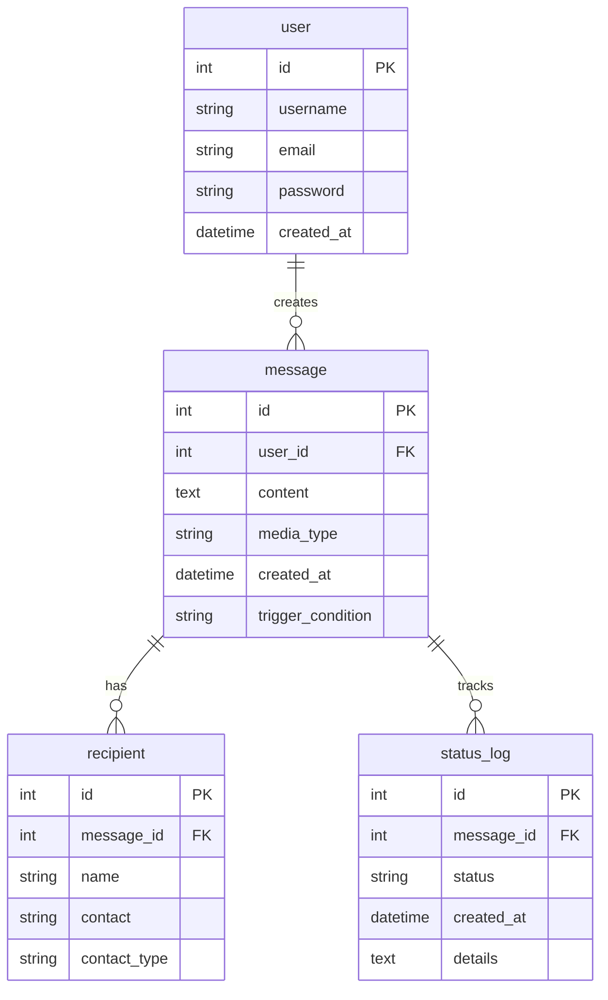

# 数据库设计文档

## 数据库架构



## 表结构设计

### 1. 用户表 (user)

```sql
CREATE TABLE user (
    id INT PRIMARY KEY AUTO_INCREMENT,
    username VARCHAR(80) UNIQUE NOT NULL,
    email VARCHAR(120) UNIQUE NOT NULL,
    password VARCHAR(120) NOT NULL,
    created_at DATETIME DEFAULT CURRENT_TIMESTAMP,
    INDEX idx_username (username),
    INDEX idx_email (email)
) ENGINE=InnoDB DEFAULT CHARSET=utf8mb4 COLLATE=utf8mb4_unicode_ci;
```

### 2. 留言表 (message)

```sql
CREATE TABLE message (
    id INT PRIMARY KEY AUTO_INCREMENT,
    user_id INT NOT NULL,
    content TEXT NOT NULL,
    media_type VARCHAR(20) NOT NULL,
    created_at DATETIME DEFAULT CURRENT_TIMESTAMP,
    trigger_condition VARCHAR(50) NOT NULL,
    FOREIGN KEY (user_id) REFERENCES user(id) ON DELETE CASCADE,
    INDEX idx_user_id (user_id),
    INDEX idx_created_at (created_at)
) ENGINE=InnoDB DEFAULT CHARSET=utf8mb4 COLLATE=utf8mb4_unicode_ci;
```

### 3. 接收人表 (recipient)

```sql
CREATE TABLE recipient (
    id INT PRIMARY KEY AUTO_INCREMENT,
    message_id INT NOT NULL,
    name VARCHAR(100) NOT NULL,
    contact VARCHAR(100) NOT NULL,
    contact_type VARCHAR(20) NOT NULL,
    FOREIGN KEY (message_id) REFERENCES message(id) ON DELETE CASCADE,
    INDEX idx_message_id (message_id)
) ENGINE=InnoDB DEFAULT CHARSET=utf8mb4 COLLATE=utf8mb4_unicode_ci;
```

### 4. 状态日志表 (status_log)

```sql
CREATE TABLE status_log (
    id INT PRIMARY KEY AUTO_INCREMENT,
    message_id INT NOT NULL,
    status VARCHAR(50) NOT NULL,
    created_at DATETIME DEFAULT CURRENT_TIMESTAMP,
    details TEXT,
    FOREIGN KEY (message_id) REFERENCES message(id) ON DELETE CASCADE,
    INDEX idx_message_id (message_id),
    INDEX idx_status (status)
) ENGINE=InnoDB DEFAULT CHARSET=utf8mb4 COLLATE=utf8mb4_unicode_ci;
```

## 索引设计

### 1. 主键索引

- 所有表都使用自增ID作为主键
- 使用InnoDB引擎确保事务支持

### 2. 外键索引

- message.user_id -> user.id
- recipient.message_id -> message.id
- status_log.message_id -> message.id

### 3. 业务索引

- user: username, email
- message: user_id, created_at
- recipient: message_id
- status_log: message_id, status

## 数据库初始化

数据库初始化通过 `scripts/init_db.py` 完成，主要步骤：

1. 创建数据库（如果不存在）
2. 创建所有表
3. 设置必要的索引
4. 初始化基础数据（如果需要）

初始化命令：

```bash
python scripts/init_db.py
```

## 数据安全

### 1. 密码安全

- 用户密码使用安全算法加密存储
- 禁止明文存储敏感信息

### 2. 数据备份

- 定期全量备份
- 实时增量备份
- 备份文件加密存储

### 3. 访问控制

- 严格的用户权限管理
- 操作日志记录
- SQL注入防护
