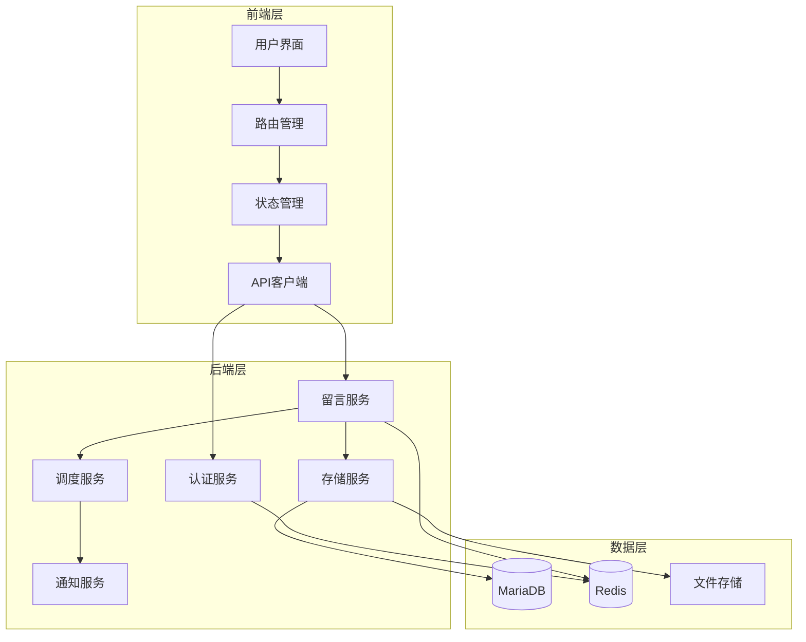
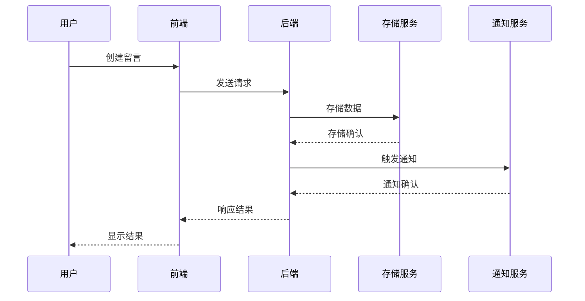
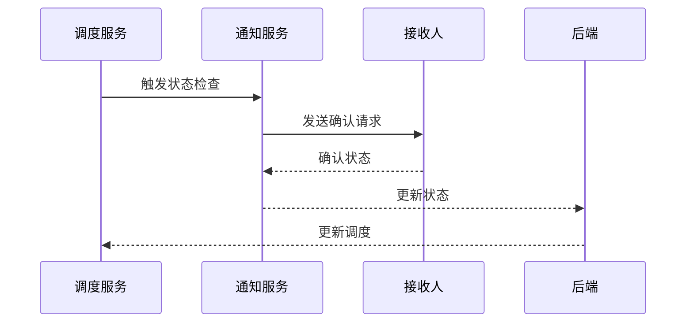

# 系统设计文档

## 系统架构图

## 系统组件

### 1. 前端层

- **用户界面（UI）**

  - 基于Element Plus组件库
  - 响应式设计
  - 主题定制支持
- **路由管理（Router）**

  - 基于Vue Router
  - 路由守卫
  - 权限控制
- **状态管理（Store）**

  - 基于Vuex
  - 模块化设计
  - 持久化存储
- **API客户端**

  - 基于Axios
  - 请求拦截器
  - 错误处理

### 2. 后端层

- **认证服务（Auth）**

  - JWT认证
  - 角色权限管理
  - 会话管理
- **留言服务（Message）**

  - 留言CRUD
  - 媒体处理
  - 状态管理
- **存储服务（Storage）**

  - 文件上传
  - 加密存储
  - 缓存管理
- **调度服务（Scheduler）**

  - 定时任务
  - 状态检查
  - 重试机制
- **通知服务（Notification）**

  - 多渠道发送
  - 发送队列
  - 状态追踪

### 3. 数据层

- **MariaDB**

  - 主从复制
  - 分表策略
  - 索引优化
- **Redis**

  - 会话存储
  - 缓存层
  - 消息队列
- **文件存储**

  - 分布式存储
  - 文件加密
  - 备份策略

## 关键流程

### 1. 留言创建流程

### 2. 状态确认流程

## 扩展性设计

### 1. 水平扩展

- 服务无状态化
- 负载均衡
- 数据库分片

### 2. 垂直扩展

- 模块化设计
- 插件系统
- 配置中心

## 高可用设计

### 1. 服务冗余

- 多实例部署
- 故障转移
- 服务降级

### 2. 数据备份

- 定期备份
- 增量备份
- 灾难恢复

## 性能优化

### 1. 前端优化

- 资源压缩
- 懒加载
- 缓存策略

### 2. 后端优化

- 数据库优化
- 缓存使用
- 异步处理

## 安全设计

### 1. 数据安全

- 传输加密
- 存储加密
- 访问控制

### 2. 应用安全

- XSS防护
- CSRF防护
- SQL注入防护

## 监控告警

### 1. 系统监控

- 服务健康检查
- 资源使用监控
- 性能指标监控

### 2. 业务监控

- 用户行为分析
- 业务指标统计
- 异常监控
