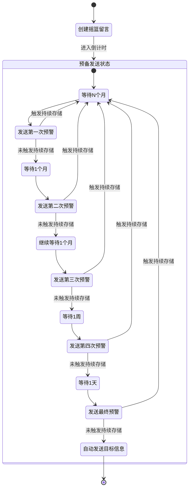

# 摇篮留言服务系统 - 系统架构

## 整体架构

系统采用经典的三层架构：

1. 表示层（前端）
2. 业务逻辑层（后端）
3. 数据访问层（数据库）

## 系统流程图

## 核心功能模块

### 1. 用户管理模块

- 用户注册
- 用户登录
- 用户认证
- 权限控制

### 2. 留言管理模块

- 留言创建
- 预警管理
- 状态追踪
- 接收人管理

### 3. 管理后台模块

- 系统概览
- 统计数据
- 系统监控
- 日志记录

## 数据流

1. 留言创建流程

   - 用户填写留言表单
   - 设置初始等待时间
   - 生成撤销密钥
   - 保存留言信息
   - 返回撤销密钥和预警时间表
2. 预警流程

   - 系统定时检查留言状态
   - 发送对应级别预警
   - 等待用户响应
   - 更新留言状态
   - 重置或继续计时
3. 最终发送流程

   - 系统检查最终预警状态
   - 准备发送内容
   - 执行发送操作
   - 记录发送结果
   - 更新留言状态

## 安全架构

1. 认证机制

   - Session认证（Web界面）
   - JWT认证（API接口）
2. 数据安全

   - 密码加密存储
   - 撤销密钥加密
   - 数据库安全访问
3. 日志记录

   - 操作日志
   - 预警日志
   - 发送日志
   - 安全审计

## 扩展性设计

1. 模块化架构

   - 功能模块独立
   - 接口统一规范
   - 易于扩展
2. 数据库设计

   - 合理的表结构
   - 预留扩展字段
   - 性能优化考虑
3. API设计

   - RESTful规范
   - 版本控制
   - 错误处理
