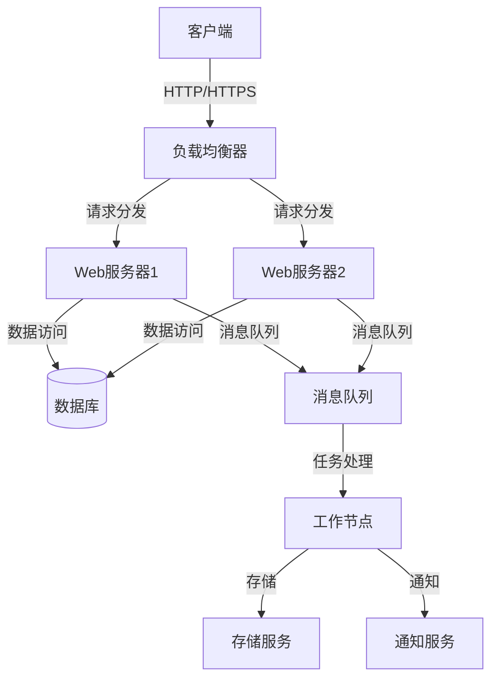
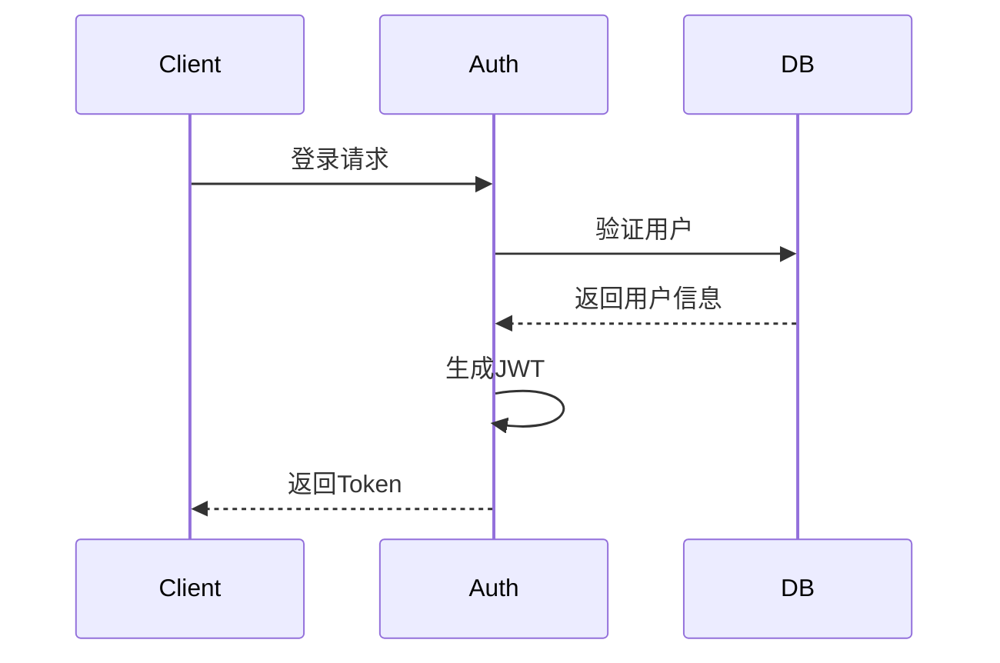
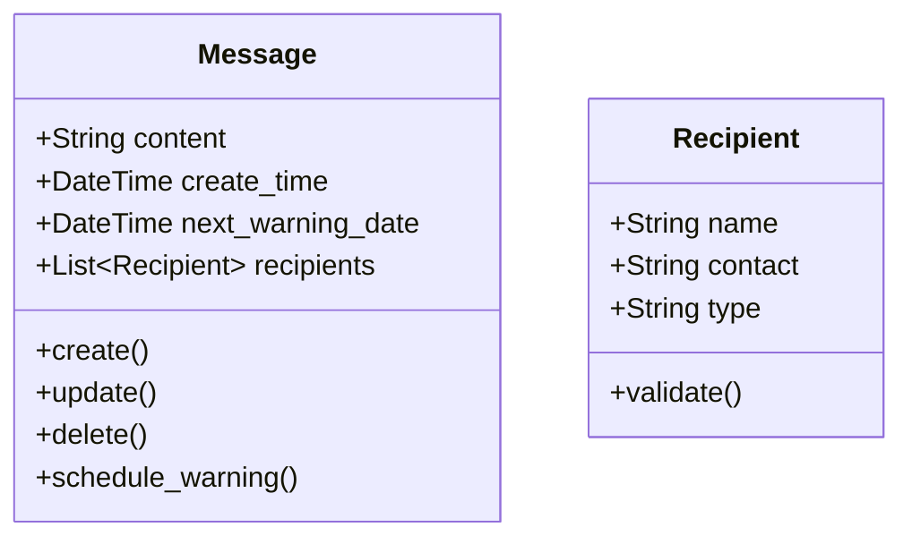
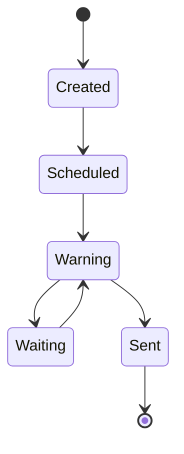

# 技术架构

## 1. 系统架构

### 1.1 整体架构

### 1.2 技术栈
- **前端技术**
  - HTML5/CSS3
  - JavaScript (ES6+)
  - Vue.js 3.0
  - Element Plus UI
  - Axios

- **后端技术**
  - Python 3.8+
  - Flask 2.0
  - SQLAlchemy
  - Celery
  - Redis

- **数据库**
  - PostgreSQL
  - Redis (缓存)
  - MongoDB (日志)

- **消息队列**
  - RabbitMQ
  - Celery Beat

- **存储服务**
  - MinIO
  - 本地文件系统

## 2. 核心模块

### 2.1 用户认证模块

- **认证流程**
  - JWT token认证
  - 基于角色的权限控制
  - 会话管理
  - 安全策略

### 2.2 留言管理模块

- **数据模型**
  - 留言实体
  - 接收人实体
  - 预警计划实体
  - 状态追踪实体

### 2.3 预警系统模块

- **预警机制**
  - 五级预警系统
  - 时间调度
  - 状态管理
  - 响应处理

### 2.4 存储系统模块

- **存储策略**
  - 数据加密
  - 分布式存储
  - 备份机制
  - 数据恢复

## 3. 安全机制

### 3.1 数据安全
- **传输安全**
  - HTTPS加密
  - 数据签名
  - 防重放攻击

- **存储安全**
  - 数据加密
  - 密钥管理
  - 访问控制

### 3.2 访问安全
- **认证机制**
  - 多因素认证
  - 会话管理
  - 登录保护

- **授权机制**
  - 基于角色的访问控制
  - 权限继承
  - 操作审计

## 4. 性能优化

### 4.1 缓存策略
- **多级缓存**
  - 浏览器缓存
  - CDN缓存
  - 应用缓存
  - 数据库缓存

- **缓存更新**
  - 缓存失效
  - 缓存预热
  - 缓存同步

### 4.2 并发处理
- **负载均衡**
  - 请求分发
  - 会话保持
  - 健康检查

- **异步处理**
  - 消息队列
  - 任务调度
  - 后台处理

## 5. 监控告警

### 5.1 系统监控
- **性能监控**
  - CPU使用率
  - 内存使用
  - 磁盘IO
  - 网络流量

- **应用监控**
  - 请求响应时间
  - 错误率
  - 并发数
  - 队列长度

### 5.2 业务监控
- **业务指标**
  - 用户活跃度
  - 功能使用率
  - 业务成功率
  - 资源使用率

- **告警机制**
  - 阈值告警
  - 趋势告警
  - 异常告警
  - 告警升级

## 6. 部署架构

### 6.1 环境配置
- **开发环境**
  - 本地开发
  - 测试环境
  - 预发布环境
  - 生产环境

- **部署策略**
  - 容器化部署
  - 服务编排
  - 配置管理
  - 版本控制

### 6.2 扩展性设计
- **水平扩展**
  - 服务扩容
  - 数据分片
  - 负载均衡
  - 故障转移

- **垂直扩展**
  - 资源升级
  - 性能优化
  - 架构调整
  - 容量规划 