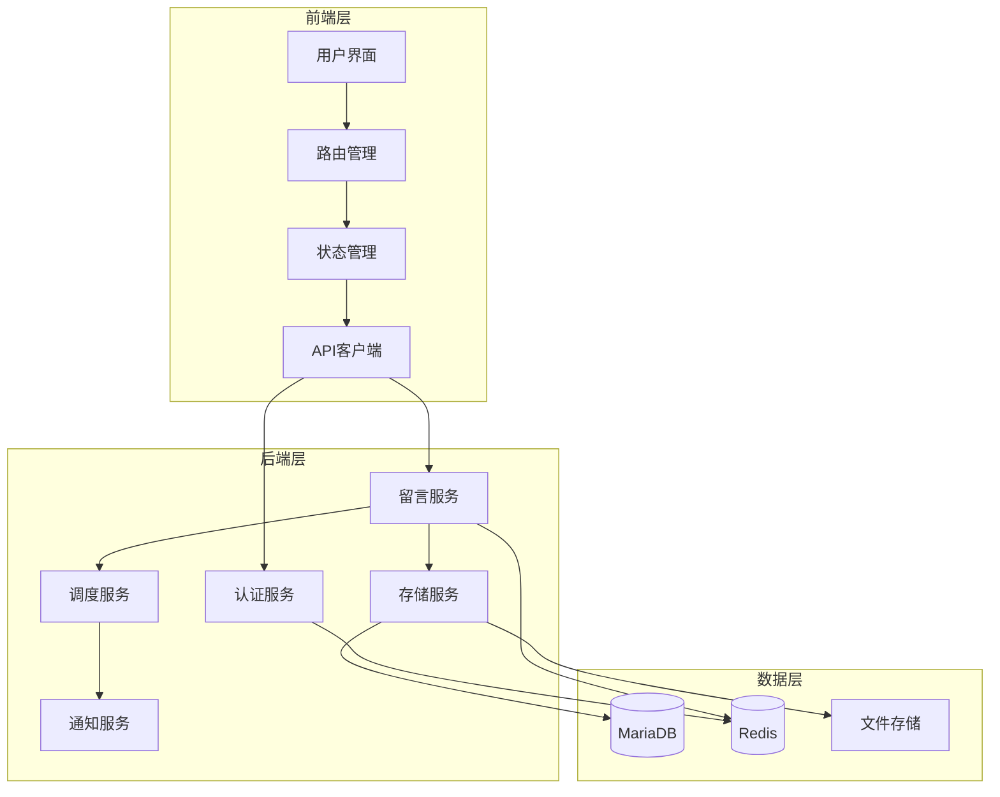
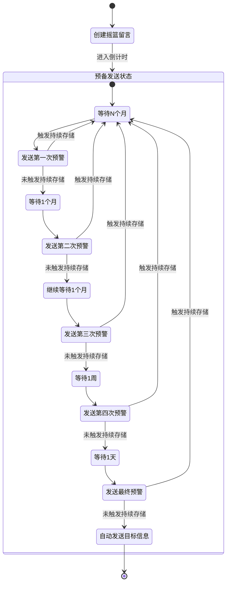

# 摇篮留言服务系统简介

## 系统概述

摇篮留言服务系统是一个专门用于创建和管理长期存储留言的Web应用。该系统通过多级预警机制和智能调度，确保留言在适当的时机安全地发送给指定的接收人。

### 设计理念

1. **安全性优先**
   - 采用多层加密机制保护留言内容
   - 实现撤销机制，确保用户对留言的完全控制
   - 严格的访问控制和权限管理

2. **可靠性保证**
   - 多级预警机制确保留言不会意外发送
   - 分布式存储和备份策略
   - 完善的错误处理和恢复机制

3. **用户友好**
   - 简洁直观的用户界面
   - 灵活的时间设置选项
   - 清晰的状态反馈和操作指引

### 核心价值

1. **长期存储**
   - 支持长达5年的留言存储
   - 定期状态确认机制
   - 灵活的时间设置选项

2. **智能预警**
   - 五级预警机制
   - 可配置的预警时间间隔
   - 用户可控的预警响应

3. **安全可靠**
   - 端到端加密
   - 多重备份机制
   - 完整的操作日志

## 系统架构

## 系统流程

## 应用场景

1. **个人遗嘱**
   - 长期存储重要信息
   - 确保信息在适当时机传达
   - 支持多级确认机制

2. **商业合同**
   - 定时触发合同条款
   - 多方确认机制
   - 完整的操作记录

3. **个人信件**
   - 长期存储情感表达
   - 灵活的发送时间设置
   - 安全的存储机制

## 技术特点

1. **高可用性**
   - 分布式架构
   - 负载均衡
   - 故障转移

2. **可扩展性**
   - 模块化设计
   - 插件化架构
   - 配置驱动

3. **安全性**
   - 端到端加密
   - 访问控制
   - 审计日志

## 未来规划

1. **功能扩展**
   - 支持更多媒体类型
   - 增加智能分析功能
   - 提供API集成能力

2. **性能优化**
   - 引入缓存机制
   - 优化数据库查询
   - 提升并发处理能力

3. **用户体验**
   - 优化界面设计
   - 增加移动端支持
   - 提供更多自定义选项 