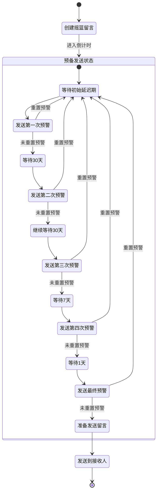

# 摇篮留言服务系统简介

## 系统概述

摇篮留言服务系统是一个基于Flask的Web应用，专门用于创建和管理长期存储留言。该系统通过多级预警机制和安全机制，确保留言在适当的时机安全地发送给指定的接收人。用户可以设置初始延迟时间，系统会按照预定的预警机制流程管理留言，同时提供撤销功能以确保用户对留言的完全控制。

### 设计理念

1. **安全性优先**
   - 采用加密存储机制保护留言内容
   - 实现唯一撤销密钥机制，确保用户对留言的完全控制
   - 基于Flask-Login和JWT的访问控制和认证管理

2. **可靠性保证**
   - 五级预警机制确保留言不会意外发送
   - 完整的状态记录和跟踪
   - 完善的错误处理和日志记录

3. **用户友好**
   - 简洁直观的用户界面
   - 灵活的时间设置选项
   - 清晰的状态反馈和操作指引

### 核心价值

1. **长期存储**
   - 支持可配置的长期留言存储
   - 用户可控的初始延迟设置（1-60个月）
   - 灵活的预警响应机制

2. **智能预警**
   - 五级递进式预警机制
   - 可重置的预警周期
   - 用户可控的预警响应

3. **安全可靠**
   - 数据加密保护
   - 撤销密钥机制
   - 完整的操作日志

## 系统架构

摇篮留言服务系统采用经典的Web应用架构，基于Flask框架开发，使用SQLAlchemy进行ORM映射，MySQL作为数据存储，同时集成了JWT和Flask-Login进行认证授权管理。

### 技术架构

- **后端框架**: Flask
- **ORM工具**: SQLAlchemy (Flask-SQLAlchemy)
- **数据库**: MySQL (通过PyMySQL)
- **认证**: Flask-Login + JWT Extended
- **模板引擎**: Jinja2
- **前端技术**: 原生JavaScript + CSS
- **加密库**: Cryptography (Fernet)

### 模块结构

```
摇篮留言服务系统
├── 用户认证模块
│   ├── 登录管理
│   ├── 会话控制
│   └── JWT认证
├── 留言管理模块
│   ├── 留言创建
│   ├── 留言存储
│   ├── 留言撤销
│   └── 接收人管理
├── 预警系统模块
│   ├── 预警计算
│   ├── 预警发送
│   └── 预警响应处理
└── 管理后台模块
    ├── 数据统计
    ├── 系统监控
    └── 用户管理
```

## 预警机制流程

摇篮留言系统的核心特性是其预警机制，确保重要留言不会被意外发送，同时提供多次确认的机会。



## 数据模型

系统包含四个主要数据模型：

1. **User (用户)**
   - id: 用户ID
   - username: 用户名
   - email: 电子邮件
   - password: 密码
   - created_at: 创建时间
   - messages: 关联的留言列表

2. **Message (留言)**
   - id: 留言ID
   - user_id: 关联的用户ID
   - content: 留言内容
   - created_at: 创建时间
   - initial_delay_months: 初始延迟月数
   - next_warning_date: 下次预警日期
   - warning_level: 当前预警级别 (0-5)
   - is_active: 是否处于活跃状态
   - revocation_key: 撤销密钥
   - recipients: 关联的接收人列表
   - status_logs: 关联的状态日志列表

3. **Recipient (接收人)**
   - id: 接收人ID
   - message_id: 关联的留言ID
   - name: 接收人姓名
   - contact: 联系方式
   - contact_type: 联系类型 (email/phone/wechat)

4. **StatusLog (状态日志)**
   - id: 日志ID
   - message_id: 关联的留言ID
   - status: 状态标识
   - created_at: 创建时间
   - details: 详细信息
   - response: 用户响应 (RESET/CONTINUE)

## 应用场景

1. **个人遗嘱**
   - 长期存储重要信息
   - 确保信息在适当时机传达
   - 支持多级确认机制

2. **时间胶囊**
   - 存储当前信息以备未来查看
   - 设定特定时间点传递
   - 私密安全的内容保护

3. **预约消息**
   - 设置未来某个时间点的消息发送
   - 可随时取消或调整
   - 安全的传递机制

## 用户流程

1. **创建留言**
   - 用户登录系统
   - 填写留言内容
   - 设置初始延迟时间 (1-60个月)
   - 添加接收人信息
   - 提交留言并获取撤销密钥

2. **管理留言**
   - 查看已创建的留言列表
   - 使用撤销密钥取消留言
   - 响应预警通知（重置或继续）

3. **预警响应**
   - 系统在预定时间发送预警通知
   - 用户选择重置预警或继续
   - 如无响应，系统按预定计划继续下一级预警

4. **留言发送**
   - 完成五级预警后，系统在24小时后自动发送留言
   - 接收人通过指定的联系方式接收
   - 留言状态更新为已发送

## 安全机制

1. **认证与授权**
   - 基于Flask-Login的Web界面认证
   - 基于JWT的API接口认证
   - 基于角色的访问控制

2. **数据保护**
   - 使用Cryptography库的Fernet对称加密
   - 敏感数据加密存储
   - 撤销密钥使用base64编码

3. **操作安全**
   - 完整的操作日志记录
   - 敏感操作需要验证
   - 预警响应确认机制

## 未来规划

1. **功能扩展**
   - 支持更多媒体类型（图片、视频、音频）
   - 增加模板功能
   - 提供更丰富的通知渠道

2. **技术升级**
   - 引入缓存机制提升性能
   - 优化数据库结构提高查询效率
   - 支持分布式部署

3. **用户体验**
   - 优化移动端界面
   - 增加更多自定义选项
   - 提供更丰富的统计分析 