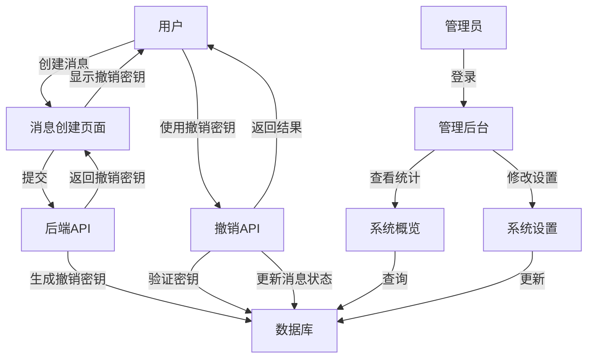
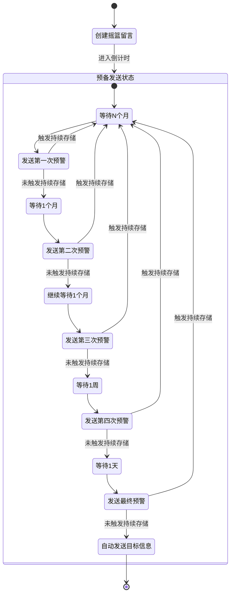

# 摇篮留言服务系统 - 技术文档

## 系统架构

### 数据库模型

1. User（用户）

   - id: 主键
   - username: 用户名（唯一）
   - email: 邮箱（唯一）
   - password: 密码
   - created_at: 创建时间
   - messages: 与Message的一对多关系
2. Message（留言）

   - id: 主键
   - user_id: 外键（关联User）
   - content: 留言内容
   - created_at: 创建时间
   - trigger_condition: 触发条件
   - is_active: 是否有效
   - revocation_key: 撤销密钥（唯一）
   - recipients: 与Recipient的一对多关系
   - status_logs: 与StatusLog的一对多关系
3. Recipient（接收人）

   - id: 主键
   - message_id: 外键（关联Message）
   - name: 接收人姓名
   - contact: 联系方式
   - contact_type: 联系方式类型（email/phone/wechat）
4. StatusLog（状态日志）

   - id: 主键
   - message_id: 外键（关联Message）
   - status: 状态
   - created_at: 创建时间
   - details: 详细信息

### 系统流程






## API接口

### 1. 创建留言

- 路径: `/api/message`
- 方法: POST
- 权限: 需要JWT认证
- 请求体:
  ```json
  {
    "content": "留言内容",
    "trigger_condition": "触发条件",
    "recipients": [
      {
        "name": "接收人姓名",
        "contact": "联系方式",
        "contact_type": "联系方式类型"
      }
    ]
  }
  ```
- 响应:
  ```json
  {
    "message": "留言创建成功",
    "revocation_key": "撤销密钥"
  }
  ```

### 2. 撤销留言

- 路径: `/api/message/revoke/<revocation_key>`
- 方法: POST
- 权限: 无需认证
- 响应:
  ```json
  {
    "message": "留言撤销成功"
  }
  ```

### 3. 更新留言状态

- 路径: `/api/message/<message_id>/status`
- 方法: POST
- 权限: 需要JWT认证
- 请求体:
  ```json
  {
    "status": "状态",
    "details": "详细信息"
  }
  ```
- 响应:
  ```json
  {
    "message": "状态更新成功"
  }
  ```

## 安全机制

1. 用户认证

   - 使用Flask-Login进行用户会话管理
   - 使用JWT进行API认证
2. 留言撤销机制

   - 使用Fernet加密生成唯一撤销密钥
   - 撤销密钥与留言一一对应
   - 无需登录即可使用撤销密钥撤销留言

## 部署说明

1. 环境要求

   - Python 3.8+
   - MySQL 5.7+
   - 必要的Python包（见requirements.txt）
2. 配置说明

   - 数据库连接配置
   - 管理员账户配置
   - JWT密钥配置
   - 日志配置
3. 初始化步骤

   - 运行数据库初始化脚本
   - 创建管理员账户
   - 启动应用服务器
