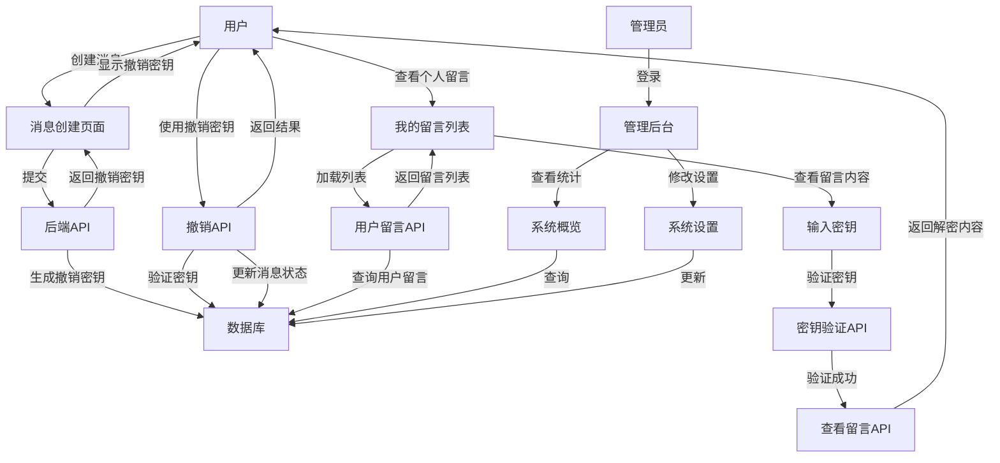
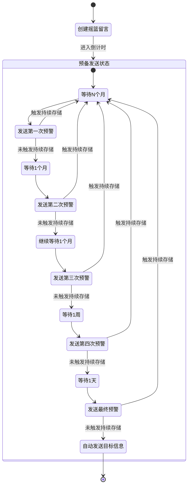

# 摇篮留言服务系统 - 技术文档

## 系统架构

### 项目结构

项目使用Flask的蓝图(Blueprint)特性进行模块化组织，主要分为以下几个模块：

- `routes/auth.py`: 认证相关路由（登录、注册、登出、调试登录）
- `routes/api.py`: API接口路由（留言创建、撤销、预警响应、用户留言列表）
- `routes/main.py`: 主要页面路由（首页、管理后台）
- `models.py`: 数据库模型定义
- `app.py`: 应用入口和配置

### 蓝图架构

蓝图(Blueprint)是Flask的一个核心特性，用于组织大型应用程序的路由和视图函数，实现代码模块化。主要优势包括：

1. **代码组织**: 将相关功能的路由和视图函数组织在一起
2. **可维护性**: 更清晰的项目结构使代码更易于维护
3. **可重用性**: 蓝图可以作为独立组件在不同项目中重用
4. **命名空间隔离**: 蓝图可以有自己的静态文件和模板
5. **延迟注册**: 可以在应用初始化后再注册路由

在本项目中，我们使用三个主要蓝图：

```python
# 认证蓝图
auth_bp = Blueprint('auth', __name__)

# API蓝图
api_bp = Blueprint('api', __name__)

# 主页和管理后台蓝图
main_bp = Blueprint('main', __name__)
```

这些蓝图在应用初始化时注册到Flask应用：

```python
# 注册蓝图
app.register_blueprint(auth_bp, url_prefix='')  # 认证路由不需要前缀
app.register_blueprint(api_bp, url_prefix='/api')  # API路由使用/api前缀
app.register_blueprint(main_bp, url_prefix='')  # 主要页面路由不需要前缀
```

### 数据库模型

1. User（用户）

   - id: 主键
   - username: 用户名（唯一）
   - email: 邮箱（唯一）
   - password: 密码
   - created_at: 创建时间
   - messages: 与Message的一对多关系
2. Message（留言）

   - id: 主键
   - user_id: 外键（关联User）
   - content: 留言内容（使用Fernet加密存储）
   - created_at: 创建时间
   - initial_delay_months: 初始等待月数
   - next_warning_date: 下次预警日期 
   - warning_level: 预警级别（0-5）
   - is_active: 是否有效
   - revocation_key: 撤销密钥（唯一）
   - recipients: 与Recipient的一对多关系
   - status_logs: 与StatusLog的一对多关系
3. Recipient（接收人）

   - id: 主键
   - message_id: 外键（关联Message）
   - name: 接收人姓名
   - contact: 联系方式
   - contact_type: 联系方式类型（email/phone/wechat）
4. StatusLog（状态日志）

   - id: 主键
   - message_id: 外键（关联Message）
   - status: 状态
   - created_at: 创建时间
   - details: 详细信息
   - response: 响应类型（RESET/CONTINUE）

### 系统流程






## API接口

### 1. 创建留言

- 路径: `/api/message`
- 方法: POST
- 权限: 需要JWT认证
- 请求体:
  ```json
  {
    "content": "留言内容",
    "initial_delay_months": 6,
    "recipients": [
      {
        "name": "接收人姓名",
        "contact": "联系方式",
        "contact_type": "联系方式类型"
      }
    ]
  }
  ```
- 响应:
  ```json
  {
    "message": "留言创建成功",
    "message_id": 123,
    "revocation_key": "撤销密钥",
    "warning_schedule": {
      "first_warning": "2023-11-20T12:00:00Z",
      "second_warning": "2023-12-20T12:00:00Z",
      "third_warning": "2024-01-20T12:00:00Z",
      "fourth_warning": "2024-01-27T12:00:00Z",
      "final_warning": "2024-01-28T12:00:00Z",
      "final_delivery": "2024-01-29T12:00:00Z"
    }
  }
  ```

### 2. 撤销留言

- 路径: `/api/message/revoke/<revocation_key>`
- 方法: POST
- 权限: 无需认证
- 响应:
  ```json
  {
    "message": "留言撤销成功并已删除所有相关数据"
  }
  ```

### 3. 查看留言

- 路径: `/api/message/view/<revocation_key>`
- 方法: GET
- 权限: 无需认证，但需要正确的撤销密钥
- 响应:
  ```json
  {
    "message_id": 123,
    "content": "解密后的留言内容",
    "created_at": "2024-03-20T12:00:00Z",
    "initial_delay_months": 6,
    "status": "活跃",
    "warning_level": 1,
    "next_warning_date": "2024-09-20T12:00:00Z",
    "recipients": [
      {
        "name": "接收人姓名",
        "contact": "联系方式",
        "contact_type": "联系方式类型"
      }
    ]
  }
  ```

### 4. 获取用户留言列表

- 路径: `/api/user/messages`
- 方法: GET
- 权限: 需要JWT认证
- 响应:
  ```json
  [
    {
      "id": 123,
      "content_preview": "需要密钥才能查看完整内容",
      "created_at": "2024-03-20T12:00:00Z",
      "initial_delay_months": 6,
      "next_warning_date": "2024-09-20T12:00:00Z",
      "warning_level": 1,
      "is_active": true,
      "recipients_count": 2,
      "status": "活跃"
    }
  ]
  ```

### 5. 验证留言密钥

- 路径: `/api/message/<message_id>/verify`
- 方法: POST
- 权限: 无需认证
- 请求体:
  ```json
  {
    "key": "撤销密钥"
  }
  ```
- 响应:
  ```json
  {
    "verified": true
  }
  ```

### 6. 根据密钥查找留言

- 路径: `/api/message/find-by-key/<revocation_key>`
- 方法: GET
- 权限: 无需认证
- 响应:
  ```json
  {
    "message_id": 123,
    "exists": true
  }
  ```

### 7. 预警响应

- 路径: `/api/message/<message_id>/warning/response`
- 方法: POST
- 权限: 需要JWT认证
- 请求体:
  ```json
  {
    "response": "RESET" // 或 "CONTINUE"
  }
  ```
- 响应:
  ```json
  {
    "message": "预警响应处理成功"
  }
  ```

## 安全机制

1. 用户认证

   - 使用Flask-Login进行用户会话管理
   - 使用JWT进行API认证
   - 密码通过werkzeug.security进行哈希保护
2. 留言加密与撤销机制

   - 使用Fernet加密算法对留言内容进行加密存储
   - 撤销密钥同时作为加密密钥，确保只有持有密钥的人才能查看内容
   - 撤销留言时完全删除数据库记录，保证数据安全
3. 密钥验证机制

   - 实现留言ID与密钥的匹配验证，防止密钥滥用
   - 查看留言内容前需要进行密钥验证
   - 撤销留言前需要验证密钥有效性

## 调试模式

系统实现了调试模式，可以快速进入不同用户身份：

1. 管理员账户登录
2. 测试用户登录

调试模式通过`DEBUG_MODE`标志控制，在生产环境中应禁用。

## 部署说明

1. 环境要求

   - Python 3.8+
   - MySQL 5.7+
   - 必要的Python包（见requirements.txt）
2. 配置说明

   - 数据库连接配置
   - JWT密钥配置
   - 日志配置
3. 初始化步骤

   - 运行数据库初始化脚本
   - 创建管理员账户
   - 启动应用服务器
