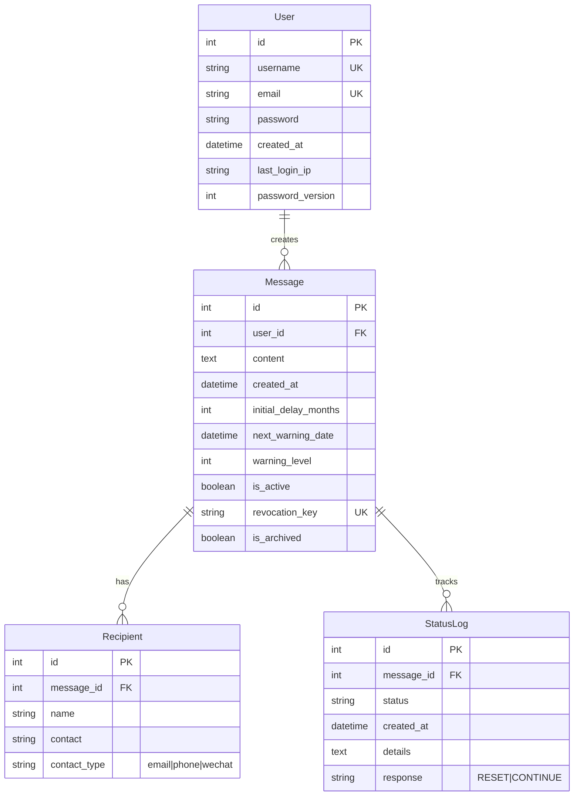

# 系统实体关系图

## 图示说明

1. **实体关系**
   - 一个用户可以创建多个留言（1:N）
   - 一个留言可以有多个接收人（1:N）
   - 一个留言可以有多个状态日志（1:N）

2. **创新设计**
   - User表：增加last_login_ip和password_version字段支持安全审计
   - Message表：使用is_archived字段实现冷热数据分离
   - Recipient表：contact_type支持多种通知渠道
   - StatusLog表：使用复合索引(user_id, message_id, status)优化查询

3. **字段说明**
   - PK: 主键
   - FK: 外键
   - UK: 唯一键
   - 时间字段统一使用datetime类型
   - 状态字段使用枚举值限制

4. **安全特性**
   - 密码历史版本追踪
   - 分层加密存储
   - 多通道通知机制
   - 完整的状态追踪
